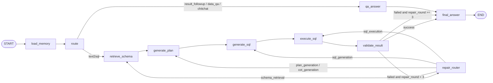

# DataSpeak 智能问数 Agent

DataSpeak 是一个面向企业私域结构化数据的智能问数 Agent。用户输入自然语言后，系统通过 LangGraph 状态机自动完成意图路由、Schema 检索、结构化 Plan、SQL 生成、只读执行、结果校验、错误回溯修正和最终数据分析输出。

## 架构



## 核心功能

- LangGraph Agent Workflow：将 Router、Schema Retrieval、Plan、SQL Generation、SQL Execution、Validation、Repair 和 QA/Fallback 封装为可观测节点。
- 动态路由：区分数据库查询、结果追问、数据问答和闲聊。
- 字段级 Schema 三级索引：关键词索引、向量索引、Rerank 索引。
- 混合检索：关键词召回 + 向量召回 + RRF 融合 + 精排。
- 结构化 Plan：输出可审计 JSON 步骤，不暴露隐藏推理链。
- SQL 安全：仅允许 SELECT，禁用写操作，自动 LIMIT，限制表字段来源。
- 工具层：`execute_sql`、`inspect_schema`、`explain_sql`、`get_last_result`。
- 回溯修正：Schema、Plan、SQL、执行四类错误最多 3 轮自动重跑。
- 记忆：短期滑动窗口 + 摘要压缩，长期记忆默认只存摘要和偏好。
- Demo：FastAPI + Streamlit + 示例业务数据 + Benchmark。

## 技术栈

FastAPI、Streamlit、LangGraph、LangChain Core、SQLite/MySQL、Redis、Milvus、Python、Pydantic、Docker Compose、BM25-like 检索、RRF、规则 fallback、Ollama/OpenAI-compatible 适配器。

## 为什么使用 LangGraph

DataSpeak 的 Text2SQL 不是单次函数调用，而是一个有状态、多分支、可回调的 Agent 流程。LangGraph 适合把每个阶段建模为状态节点，并用条件边表达动态路由和失败修复路径：

- 状态持久化扩展：所有中间结果都写入 `DataSpeakGraphState`。
- 条件边：根据 route、validation_result 和 callback_module 决定下一跳。
- 失败回调：Schema、Plan、SQL、Execution 四类错误可回跳到对应节点。
- 可观测 trace：API 和前端可展示每个节点的输入摘要和输出摘要。
- 多轮修复：`repair_round` 控制最多 3 轮自动修正。

## 为什么不是简单 Text2SQL

简单 Text2SQL 通常是“问题 + Schema -> SQL”。DataSpeak 在 SQL 前增加 Schema 三级检索和结构化 Plan，在 SQL 后增加安全审计、执行日志校验和回溯修正，并通过 LangGraph 将这些步骤变成可观测、可调试、可评测的 Agent 状态机。

## 与 AskData 思路对应关系

- AskData 的 Schema 三级索引：DataSpeak 实现字段级关键词、向量和 Rerank 文档。
- AskData 的混合召回：DataSpeak 实现动态 Top-K、RRF 融合和本地精排。
- AskData 的 CoT 四元组：DataSpeak 改为结构化 JSON Plan，避免暴露隐藏推理链。
- AskData 的 MCP SQL 执行：DataSpeak 以内置 Tool Registry 复刻工具调用层。
- AskData 的校验回调：DataSpeak 通过 LangGraph 条件边实现最多 3 轮自动修正和 trace 日志。

## 本地运行

```powershell
cd /d C:\Users\24607\Desktop\项目\DataSpeak
conda activate ds
pip install -r requirements.txt
python scripts/init_demo_data.py
python scripts/build_schema_index.py
uvicorn dataspeak.app.main:app --host 127.0.0.1 --port 18088
streamlit run dataspeak_web/app.py --server.port 18501
```

API 文档：`http://127.0.0.1:18088/docs`

前端 Demo：`http://127.0.0.1:18501`

### Windows 一键启动

```powershell
cd /d C:\Users\24607\Desktop\项目\DataSpeak
conda activate ds
powershell -ExecutionPolicy Bypass -File scripts/start_dataspeak.ps1
```

脚本会检查项目目录和 conda 环境，必要时从 `.env.example` 复制 `.env`，使用 `docker compose -p dataspeak up -d` 启动 DataSpeak 专属 Docker 服务，初始化 demo 数据、构建 Schema 索引，并在两个新的 PowerShell 窗口中分别启动 FastAPI 与 Streamlit。

### Windows 一键关闭

```powershell
cd /d C:\Users\24607\Desktop\项目\DataSpeak
powershell -ExecutionPolicy Bypass -File scripts/stop_dataspeak.ps1
```

脚本只按端口 `18501`、`18088` 和 Docker Compose project `dataspeak` 定位资源，停止 Streamlit、FastAPI 与 DataSpeak Docker 服务，不会删除容器、卷或影响 EnterpriseMind。

## 测试与评测

```powershell
pytest -q
python scripts/smoke_test.py
python -m dataspeak.evaluation.benchmark
```

### Windows 一键测试

```powershell
cd /d C:\Users\24607\Desktop\项目\DataSpeak
conda activate ds
powershell -ExecutionPolicy Bypass -File scripts/test_dataspeak.ps1
```

测试脚本只在 `ds` 环境中运行 `pytest -q`、`python scripts/smoke_test.py` 和 `python -m dataspeak.evaluation.benchmark`，不会启动、停止或删除 Docker 容器。

## 简历写法

DataSpeak 智能问数 Agent｜后端开发 / 大模型应用

- 基于 LangGraph 构建 Text2SQL Agent 状态机，将意图路由、Schema 检索、结构化 Plan、SQL 生成、只读执行、结果校验和回溯修正封装为可观测节点，并通过条件边实现数据库查询、结果追问和最大 3 轮错误修复的动态流转。
- 构建字段级 Schema 三级索引，结合 BM25 关键词检索、向量检索、RRF 融合和 Rerank 重排序，提高复杂 Query 下字段召回与排序准确率。
- 引入 SQL 安全审计、只读执行、执行日志校验和 Agent trace，提升复杂多表查询的稳定性与可解释性。
